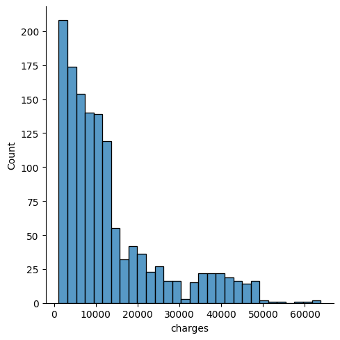
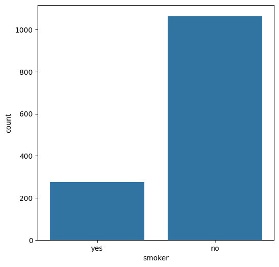
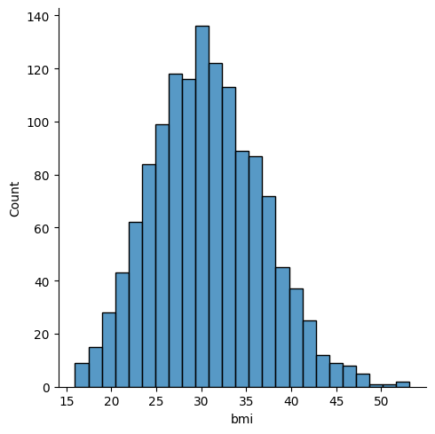
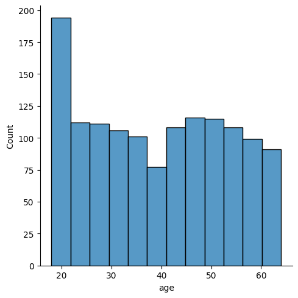

# Medical Insurance Cost Predictor


## Overview

The Medical Insurance Premium Predictor is an end-to-end Machine Learning application designed to estimate health insurance costs based on individual demographic and lifestyle factors.

This repository tracks the evolution of the project: starting from data exploration and model training in a Jupyter Notebook, and upgrading into a **production-ready, modular software architecture** featuring a decoupled FastAPI backend, an interactive Streamlit frontend, and full Docker containerization.
It is fully equipped for live deployment on cloud platforms.

## 🌐 Live Demo
[](http://13.206.207.81:8501/)

**Test the application live here:** [Medical Insurance Cost Predictor](http://13.206.207.81:8501/)  
*(Note: Deployed via AWS EC2. If the link is temporarily inactive, the server may be paused to conserve cloud resources.)*

---

## Key Features & Architecture

* **Decoupled Microservices:** The user interface (Streamlit) is completely separated from the inference engine (FastAPI), allowing for highly scalable and platform-agnostic deployments.
* **Modular ML Pipeline (`src/` architecture):** Data ingestion, preprocessing, and model training are separated into isolated modules (`data_loader.py`, `preprocess.py`, `train.py`) for clean code, easy testing, and maintainability.
* **Training-Serving Skew Prevention:** The preprocessing logic (One-Hot Encoding, Standard Scaling) and the optimal ML algorithm are bundled together and serialized as a single `joblib` Pipeline (`MIPML.pkl`). The exact same data transformations used in training are automatically applied during API inference.
* **Strict Data Validation:** The backend uses **Pydantic** schemas to enforce strict boundary constraints (e.g., age must be 18-100), intercepting malformed data before it can crash the ML model.
* **Production Observability:** Custom logging tracks timestamped predictions and API calls to monitor for potential data drift over time.
* **Cloud-Native Design:** Employs environmental variables (DOCKER_ENV) to seamlessly switch between local development and cloud deployments (like AWS EC2) without altering source code.

---

##  Exploratory Data Analysis (EDA)
During the development of this model, extensive data exploration was conducted to understand the distribution of features and their impact on insurance charges. Below are some of the key visualizations from the analysis:

### 1. Distribution of Insurance Charges

**Insight:** The target variable, `charges`, is heavily right-skewed. Most beneficiaries incur lower medical costs (typically under $15,000), while a smaller subset of individuals faces significantly higher premiums. This skewness indicates that a few key risk factors are driving up the costs for certain individuals.

### 2. The Impact of Smoking Status

**Insight:** Smoking is the most critical feature in the dataset. As shown in the plot, there is a stark contrast between smokers and non-smokers. Smokers form a distinct cluster with drastically higher baseline medical charges compared to non-smokers, making this a highly influential predictor for the machine learning model.

### 3. BMI (Body Mass Index) Trends

**Insight:** Body Mass Index shows a normal distribution, with most individuals falling between the 25 and 35 range. When combined with other risk factors (like smoking), a higher BMI exponentially increases the overall medical insurance premium, highlighting the compound effect of multiple health risks.

### 4. Age Demographics

**Insight:** The dataset includes individuals ranging from 18 to 64 years old. Interestingly, there is a massive spike in the 18-19 age group, representing a large influx of young adults entering the insurance pool. Outside of that spike, the distribution is relatively uniform across other age groups.

---


## 🛠️ Tech Stack
* **Language:** Python 3.9
* **Front-end UI:** Streamlit
* **Back-end API:** FastAPI, Uvicorn, Pydantic
* **Machine Learning:** Scikit-Learn, Joblib
* **Data Manipulation:** Pandas, NumPy
* **Data Visualization (EDA):** Matplotlib, Seaborn
* **DevOps / Deployment:** Docker, Docker Compose, AWS EC2, Docker Hub

---


## 📂 Project Structure

```text
├── app/                         # Backend API Package
│   ├── __init__.py
│   ├── main.py                  # FastAPI server and REST routes
│   ├── prediction.py            # Prediction logic
│   ├── schema.py                # Pydantic data validation schemas
│   └── utils.py                 # Logging and utility functions
├── assets/                      # Images and plots from EDA
├── data/
│   └── insurance.csv            # Raw dataset
├── logs/                        # Application logs (mounted via Docker)
├── models/
│   ├── MIPML.pkl                # Legacy model
│   └── pipeline.pkl             # Active Serialized Scikit-Learn Pipeline 
├── src/                         # Machine Learning Modules
│   ├── data_loader.py           # Data ingestion and train/test splitting
│   ├── preprocess.py            # ColumnTransformer (Scaling & One-Hot Encoding)
│   └── train.py                 # Evaluates multiple algorithms and returns the best model
├── .gitignore                   # Git ignore rules
├── docker-compose.yml           # Orchestrates the multi-container application
├── Dockerfile.api               # Configuration for the FastAPI backend container
├── Dockerfile.ui                # Configuration for the Streamlit frontend container
├── homee.png                    # UI Screenshot / Asset
├── medical_insurance_prediction.ipynb # Original EDA and model prototyping notebook
├── requirements.txt             # Project dependencies
├── setup.bat                    # Windows setup script
├── streamlit_frontend.py        # Streamlit application script (Frontend)
└── train_pipeline.py            # Master orchestrator script to build and save the model
```
---


## ⚙️ How It Works (The Data Flow)

1. **User Input:** The application takes six inputs via the Streamlit UI: Age, Gender, BMI, Children, Smoker status, and Region.
2. **API Request:** Streamlit packages these inputs into a JSON payload and sends a `POST` request to the FastAPI backend.
3. **Validation:** FastAPI uses Pydantic to ensure all inputs are valid and within safe ranges.
4. **Inference:** The validated data is converted to a Pandas DataFrame and passed into the `pipeline.pkl` Pipeline. The pipeline automatically applies the necessary scalers and encoders, makes the prediction using the ensemble regressor, and returns the estimated premium.


---

## 🚀 Installation and Setup


**1. Clone the repository:**
```bash
git clone https://github.com/Sh0hil/medical-insurance-cost-predictor
cd medical-insurance-cost-predictor
```


**2. Build and run the containers:**
```bash
docker-compose up --build
```


**3. Install the required dependencies:**
```bash
pip install -r requirements.txt
```
The Streamlit UI will be available at http://localhost:8501, and the FastAPI backend will be running at http://localhost:8000

Option 2: Run Locally (Without Docker)
If you prefer to run the application locally for development purposes:

1. Create and activate a virtual environment:
```bash
python -m venv venv
source venv/bin/activate  # On Windows use: venv\Scripts\activate
```
2. Install dependencies:
```bash
pip install -r requirements.txt
```

**4. Start the Application (Requires Two Terminals):**
Terminal 1 (Start the Backend):
```bash
uvicorn app.main:app --reload --port 8000
```
Terminal 2 (Start the Frontend):
```bash
streamlit run streamlit_frontend.py
```

Option 3: Cloud Deployment (AWS EC2)
This application is configured for deployment using pre-built images from Docker Hub.

Provision an Ubuntu EC2 instance and ensure Security Groups allow inbound traffic on ports 8000 and 8501.

Install Docker and Docker Compose on the instance.

Update docker-compose.yml to pull from your Docker Hub registry instead of building locally.

Run sudo docker compose up -d to launch the detached containers.


**Author** 
---
Shohil Khan

Final-Year, B.Tech Computer Science & Engineering Student | Aspiring AI & ML Engineer

Passionate about building scalable machine learning systems, generative AI, and end-to-end data pipelines.
